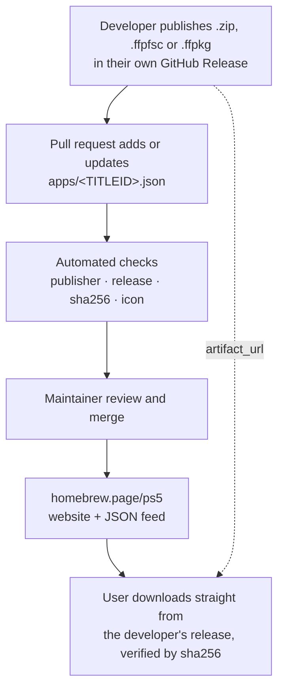

# PS5 Homebrew Catalog

[](https://github.com/blackbearreloaded/ps5-homebrew-catalog/actions/workflows/ci.yml)
[](https://github.com/blackbearreloaded/ps5-homebrew-catalog/actions/workflows/health.yml)

A community-maintained index of PS5 homebrew. Each app is one small JSON record
that points to a release file its developer hosts in their own GitHub Releases.
This repository stores no binaries.

The records here are the source of the [PS5 homebrew website](https://homebrew.page/ps5/),
and they will feed a console-side store that can install listed apps.

## How it works



1. A developer publishes a versioned artifact in their project's GitHub Releases.
2. They open a pull request that adds or updates `apps/<TITLEID>.json`.
3. Automation verifies the record, the publisher, the release, the exact bytes
   (sha256), and the icon.
4. A maintainer reviews and merges; the website and feed are rebuilt from `main`.

Downloads always come from the developer's own release, pinned by sha256, so a
listed app can't be silently replaced.

## Add your app

Read **[Submitting an app](docs/submitting.md)**. In short:

1. Package your app as a `.zip` app folder, `.ffpfsc` image or `.ffpkg`
   ([artifact formats](docs/artifact-formats.md)).
2. Publish it in a release of your public GitHub repository.
3. Add `apps/<TITLEID>.json` from the account that owns that repository.
4. Open a pull request and fix anything the checks report.

## Record format

One file per app, named after its title ID, with exactly these eleven string fields:

```json
{
  "titleid": "PPSA01234",
  "name": "Example App",
  "kind": "app",
  "description": "One short sentence about the app.",
  "license": "GPL-3.0",
  "author": "Example Dev",
  "version": "01.000.000",
  "source_repo": "https://github.com/example/example-app",
  "artifact_url": "https://github.com/example/example-app/releases/download/01.000.000/PPSA01234.zip",
  "sha256": "2432640a5dc4a4cb57ffcdb2ce347329a687ddff526f6e19d0495f1efd136317",
  "icon_url": "https://raw.githubusercontent.com/example/example-app/01.000.000/sce_sys/icon0.png"
}
```

Field rules and limits are in **[Metadata format](docs/metadata.md)**.

## What gets checked

| Check | Pull request | Push to `main` | Weekly |
| --- | :---: | :---: | :---: |
| JSON format, fields, text, URLs, uniqueness | ✓ | ✓ | ✓ |
| Only `apps/<TITLEID>.json` changed, one app per PR | ✓ | | |
| Submitter owns the source repository | ✓ | | |
| Release, asset and license exist and match | ✓ | ✓ | ✓ |
| Downloaded bytes match `sha256` | ✓ | ✓ | ✓ |
| Icon is a reachable PNG, JPEG or WebP image | ✓ | ✓ | ✓ |
| Newer upstream release available (report only) | | | ✓ |

Pushes to `main` verify only the records they change; the weekly run verifies all
of them. Artifacts are downloaded only to hash them; they are never opened or executed. See
**[Automation](docs/automation.md)** for how the checks work and why they are safe
to run on untrusted pull requests.

## Website

Cloudflare Pages rebuilds the store from `main` after every merge. The build
also publishes a JSON feed at `/ps5/catalog/v1.json` for the console store and
other clients. See **[Website](docs/website.md)** for the output, themes, local
preview and Cloudflare setup.

## Trust and safety

Listing means the automated checks passed and a maintainer reviewed the
submission's publisher and provenance. It is **not** a security audit of the
app's code. See the **[review policy](docs/review-policy.md)** for how listings,
updates, title ID disputes and withdrawals are handled.

Report a broken or incorrect listing with an
[issue](https://github.com/blackbearreloaded/ps5-homebrew-catalog/issues/new/choose).
Report a malicious or compromised app privately as described in
[SECURITY.md](SECURITY.md).

## Repository layout

```text
apps/                 One <TITLEID>.json record per app
catalog/              Checker, verifier and site generator (Python standard library)
site/                 Website themes, templates and shared assets
tests/                Unit and end-to-end tests for the checker
docs/                 Submission guide, formats, policy, automation, website
.github/workflows/    Submission check, CI, weekly health check
```

## Run the checks locally

Python 3.10 or newer, no dependencies:

```sh
python3 -m catalog check                  # offline: every record's format
python3 -m catalog verify PPSA01234       # online: release, sha256, icon
python3 -m catalog digest <artifact_url>  # print the sha256 GitHub reports
python3 -m catalog build                  # build the website into dist/
python3 -m unittest discover -s tests     # checker tests
```

Set `GITHUB_TOKEN` to avoid GitHub's anonymous API rate limit.

## License

The catalog tooling and documentation are licensed under [GPL-3.0](LICENSE).
Each listed app is distributed by its own developer under the license in its record.
